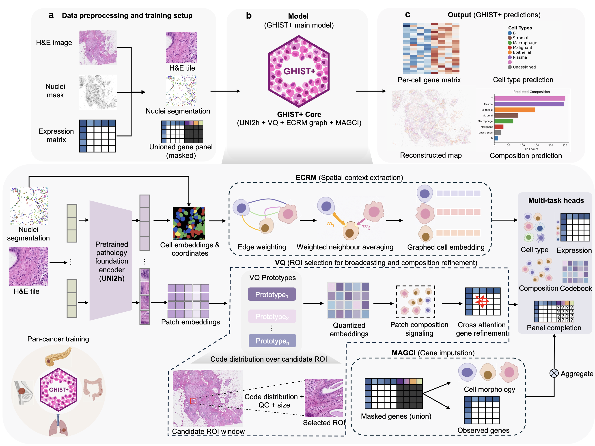

# GHIST+

GHIST+ predicts single-cell spatial gene expression from H&E histology.

<p align="center">
  
</p>

This repository contains the training, inference, model, and data-loading code.
It is not packaged as a Python library; run commands from the repository root.

## Repository Layout

- `train.py`: main training entry point.
- `tools/inference.py`: checkpoint inference and prediction export.
- `configs/`: example training and inference configs.
- `dataio/`: image, nuclei, patch, and expression data loaders.
- `model/`: GHIST+ model components.
- `utils/`: config, device, image, and helper utilities.
- `example.ipynb`: BreastCancer2 inference example.

## Installation

Use a CUDA-enabled machine with a compatible PyTorch install.

```bash
conda create --name model_env python=3.10
conda activate model_env

pip install torch torchvision
pip install numpy pandas scipy scikit-learn matplotlib tqdm natsort h5py
pip install tifffile imageio opencv-python pillow timm huggingface_hub torchstain
pip install git+https://github.com/sebastianffx/stainlib.git
```

The first run may download the UNI2-h checkpoint through the Hugging Face cache.

## Example Notebook

Before running `example.ipynb`, download the example data/model bundle from the
Google Drive link provided with this release: https://drive.google.com/drive/folders/1b3LPQRywaooIDDGBMGVzMvrSLNXokLXx?usp=drive_link.

Name the downloaded folder exactly:

```text
example_bundle
```

Place it in the same parent directory as this repository. Then open
`example.ipynb` and run the cells from top to bottom. Outputs are written to:

```text
<downloaded bundle>/inference_outputs/breast2_fullslide/
```

The example runs BreastCancer2 fullslide prediction using the H&E image, nuclei
segmentation, saved checkpoint, stripped cache, and train-derived average
expression reference. BreastCancer2 expression and cell-type labels are not used
during prediction.

## Data Configuration

Configs use environment-variable placeholders for local data and run paths.
Set those paths before training or edit the config directly.

Each slide entry should point to:

- aligned H&E image
- nuclei segmentation mask
- matched nuclei metadata
- expression matrix and cell-type labels for training/evaluation slides

For prediction-only inference, target expression labels are not required.

## Training

Run from the repository root:

```bash
python train.py \
  --config_file configs/config_all_cancers.json \
  --fold_id 1 \
  --gpu_id 0
```

Training outputs include the copied config, `genes.txt`, stain
standardisation file, checkpoints, metrics, and imputed cache files.

## Inference

Run inference from a completed training run:

```bash
python tools/inference.py \
  --experiment_path results/fold1_YYYY_MM_DD_HH_MM_SS \
  --config_file configs/config_all_cancers.json \
  --impute_dir /path/to/cache_root/imputed_<hash> \
  --slide_id 14 \
  --gpu_id 0 \
  --output_dir /path/to/inference_output
```

Use `--checkpoint_path /path/to/epoch_N_model.pth` to select a specific
checkpoint. Use `--skip_metrics` for prediction-only runs without target labels.

Main outputs:

- `*_pred_expr_scaled.csv`
- `*_pred_expr_scaled.npz`
- `*_pred_celltype.csv`
- `*_pred_celltype_probs.csv`
- `*_meta.json`

## Notes

- Large generated files are ignored by `.gitignore`.
- Keep the config, checkpoint, `genes.txt`, stain standardisation file, and
  matching cache together when moving a trained run.
