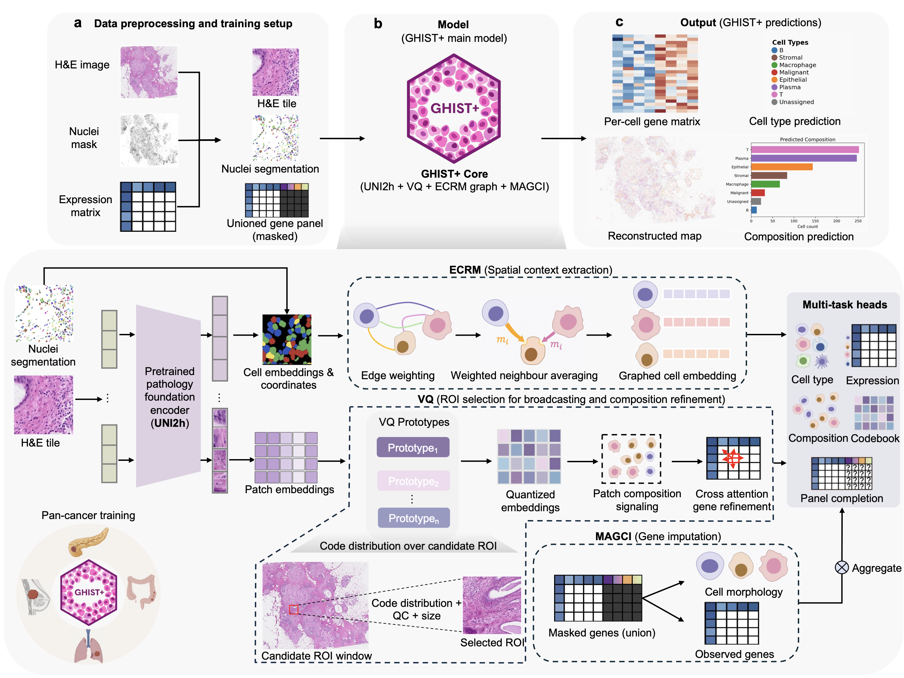

# GHIST+

GHIST+ reconstructs tissue-wide single-cell molecular states from H&E
histology.
<p align="center">
  
</p>

## Quick Start

- **New users:** start with [tutorial.ipynb](tutorial.ipynb).
- **Reproduce Figures 2–5:** follow the [figure instructions](#reproduce-figures-25).
- **Run released-checkpoint inference:** additionally reconstruct the four
  checkpoints once.
- **Train a model:** install the environment, configure your data, then run
  `train.py`.

## Installation

Use a CUDA-enabled Linux machine with a compatible PyTorch install. The code was
tested on Ubuntu 24.04.1 LTS, Python 3.10.16, NVIDIA RTX A6000 GPUs, driver
550.120, and PyTorch 2.6.0 with CUDA 12.4.

```bash
conda create --name model_env python=3.10
conda activate model_env

pip install torch==2.6.0 torchvision==0.21.0 \
  --index-url https://download.pytorch.org/whl/cu124
pip install numpy pandas scipy scikit-learn matplotlib tqdm natsort h5py
pip install tifffile imageio opencv-python pillow timm "huggingface_hub>=0.34" torchstain
pip install git+https://github.com/sebastianffx/stainlib.git
python -m pip install jupyterlab ipykernel anndata==0.11.4 pyucell==0.5.0 "zarr<3"
```

<details>
<summary>Tested package versions</summary>

Tested package versions include `torch==2.6.0`, `torchvision==0.21.0`,
`numpy==1.26.4`, `pandas==2.3.2`, `scipy==1.15.3`, `scikit-learn==1.7.1`,
`matplotlib==3.8.2`, `timm==0.9.12`, `huggingface_hub==0.33.2`, and
`torchstain==1.4.1`.

</details>

Installation usually takes 10-30 minutes on a CUDA Linux workstation, excluding
large downloads. Training can download UNI2-H through the Hugging Face cache.

## Reproduce Figures 2–5

These notebooks regenerate figures from the released expression predictions and
analysis tables. Training and checkpoint reconstruction are not required.

| Notebook | Contents |
| --- | --- |
| [Figure2.ipynb](Figure2.ipynb) | ROI pathway and correlation plots (panels b–f) |
| [Figure3.ipynb](Figure3.ipynb) | Expression prediction benchmarks |
| [Figure4.ipynb](Figure4.ipynb) | Gene imputation and VQ/composition ablation |
| [Figure5.ipynb](Figure5.ipynb) | Single-slide and PanCancer comparisons |

After [Installation](#installation), run the following from the repository
folder. Replace `/path/to/bundle` with your chosen download folder for the
[public bundle](https://huggingface.co/datasets/SydneyBioX/GHIST-Plus-bundle)
(approximately 38 GB). Skip the download command if you already have the bundle.
Figure 2 uses the included CSVs; skip the bundle download and
`GHIST_BUNDLE_ROOT` steps for that notebook.

```bash
conda activate model_env
hf download SydneyBioX/GHIST-Plus-bundle \
  --repo-type dataset \
  --local-dir /path/to/bundle
export GHIST_BUNDLE_ROOT="/path/to/bundle"
python -m ipykernel install --sys-prefix --name ghist-plus --display-name "GHIST+ (model_env)"
python -m jupyterlab
```

Open the desired `Figure2.ipynb`–`Figure5.ipynb`, select **GHIST+ (model_env)**,
then choose **Restart Kernel and Run All**. Each notebook runs independently.
Figures appear inside the notebook; save the notebook to keep its outputs.

`GHIST_BUNDLE_ROOT` must point to the folder containing `GHIST_plus/`,
`evaluation_data/`, `figure_data/`, and `other_models/`. The tutorial uses
separately prepared training data.

## Released Data and Checkpoints

### Pretrained checkpoints

The released checkpoints are available in the public
[GHIST+ bundle](https://huggingface.co/datasets/SydneyBioX/GHIST-Plus-bundle):

| Workflow | Checkpoint |
| --- | --- |
| Breast single-slide | [`ghist_plus_breast_single_checkpoint.pth`](https://huggingface.co/datasets/SydneyBioX/GHIST-Plus-bundle/blob/main/GHIST_plus/models/breast_single/ghist_plus_breast_single_checkpoint.pth) |
| Breast multi-slide | [`ghist_plus_breast_multi_checkpoint.pth`](https://huggingface.co/datasets/SydneyBioX/GHIST-Plus-bundle/blob/main/GHIST_plus/models/breast_multi/ghist_plus_breast_multi_checkpoint.pth) |
| Gene imputation | [`ghist_plus_gene_imputation_checkpoint.pth`](https://huggingface.co/datasets/SydneyBioX/GHIST-Plus-bundle/blob/main/GHIST_plus/models/imputation/ghist_plus_gene_imputation_checkpoint.pth) |
| PanCancer | [`ghist_plus_pancancer_checkpoint.pth`](https://huggingface.co/datasets/SydneyBioX/GHIST-Plus-bundle/blob/main/GHIST_plus/models/pancancer/ghist_plus_pancancer_checkpoint.pth) |

Each model folder includes its matching config, gene panel, and standardisation
file. Complete the UNI2-H reconstruction step below before inference.

Download the bundle using the [instructions above](#reproduce-figures-25).

The released checkpoints exclude the third-party UNI2-H encoder weights.
Before using them:

1. Accept the terms for
   [MahmoodLab/UNI2-h](https://huggingface.co/MahmoodLab/UNI2-h).
2. Download `pytorch_model.bin` from that page.
3. Run the reconstruction command below once using the downloaded file.

<details>
<summary>Reconstruct the four released checkpoints</summary>

```bash
python - "$GHIST_BUNDLE_ROOT" /path/to/pytorch_model.bin <<'PY'
import os
import sys
from pathlib import Path

import torch

bundle = Path(sys.argv[1]).expanduser().resolve()
uni2_path = Path(sys.argv[2]).expanduser().resolve()
if not uni2_path.is_file():
    raise FileNotFoundError(uni2_path)

uni2 = torch.load(uni2_path, map_location="cpu", weights_only=True)
model_dir = bundle / "GHIST_plus" / "models"
for path in sorted(model_dir.glob("*/*_checkpoint.pth")):
    checkpoint = torch.load(path, map_location="cpu", weights_only=True)
    if checkpoint.get("checkpoint_format") != "ghist-plus-external-backbone-v1":
        continue

    state = checkpoint["model_state_dict"]
    state.update({f"cnn.enc.vit.{key}": value for key, value in uni2.items()})
    state.update({
        f"_encoder_blocks.{key.removeprefix('blocks.')}": value
        for key, value in uni2.items()
        if key.startswith("blocks.")
    })

    temporary = path.with_suffix(".reconstructed.pth")
    torch.save({"epoch": checkpoint["epoch"], "model_state_dict": state}, temporary)
    os.replace(temporary, path)
    print(f"Prepared {path}")
PY
```

</details>

This modifies only the four downloaded checkpoint copies and keeps their
filenames unchanged. Allow approximately 15 GB of additional free disk space
for reconstruction. UNI2-H remains subject to its upstream terms.

## Data Setup

Update the data and output paths in your chosen JSON config before training.
The tutorial shows the required settings for single-slide, multi-slide, and
PanCancer workflows.

Each slide entry should point to:

- aligned H&E image
- nuclei segmentation mask
- matched nuclei metadata
- expression matrix and cell-type labels for training/evaluation slides

For prediction-only inference, target expression labels are not required.

## Tutorial

Open `tutorial.ipynb` from the repository root. Select `single`, `multi`, or
`pancancer`, set the data root, and run the cells from top to bottom.

## Training

Run from the repository root:

```bash
python train.py \
  --config_file configs/config_all_cancers.json \
  --fold_id 1 \
  --gpu_id 0
```

Training outputs include the copied config, `genes.txt`, stain
standardisation file, checkpoints, metrics, and imputed cache files.

## Inference

Run inference from a completed training run or a reconstructed released
checkpoint:

```bash
python tools/inference.py \
  --experiment_path results/fold1_YYYY_MM_DD_HH_MM_SS \
  --config_file configs/config_all_cancers.json \
  --checkpoint_path /path/to/released_checkpoint.pth \
  --impute_dir /path/to/cache_root/imputed_<hash> \
  --slide_id 14 \
  --gpu_id 0 \
  --output_dir /path/to/inference_output
```

For a released checkpoint, set `--experiment_path` to its model directory and
pass its config and checkpoint explicitly. Use
`--skip_metrics` for prediction-only runs without target labels.

Main outputs:

- `*_pred_expr_scaled.csv`
- `*_pred_expr_scaled.npz`
- `*_pred_celltype.csv`
- `*_pred_celltype_probs.csv`
- `*_meta.json`

## Repository Layout

- `train.py`: main training entry point.
- `tools/inference.py`: checkpoint inference and prediction export.
- `tutorial.ipynb`: single-slide, multi-slide, and PanCancer walkthrough.
- `configs/`: publication training configs.
- `dataio/`: data loaders.
- `model/`: GHIST+ model components.
- `utils/`: shared utilities.

## Notes

- Large generated files are ignored by `.gitignore`.
- The hurdle output predicts expression presence separately from positive
  magnitude; validation and inference use the same deterministic prevalence
  gate.
- Keep the config, checkpoint, `genes.txt`, stain standardisation file, and
  matching cache together when moving a trained run.
- Component-specific third-party terms are provided on the
  [Hugging Face dataset page](https://huggingface.co/datasets/SydneyBioX/GHIST-Plus-bundle).
